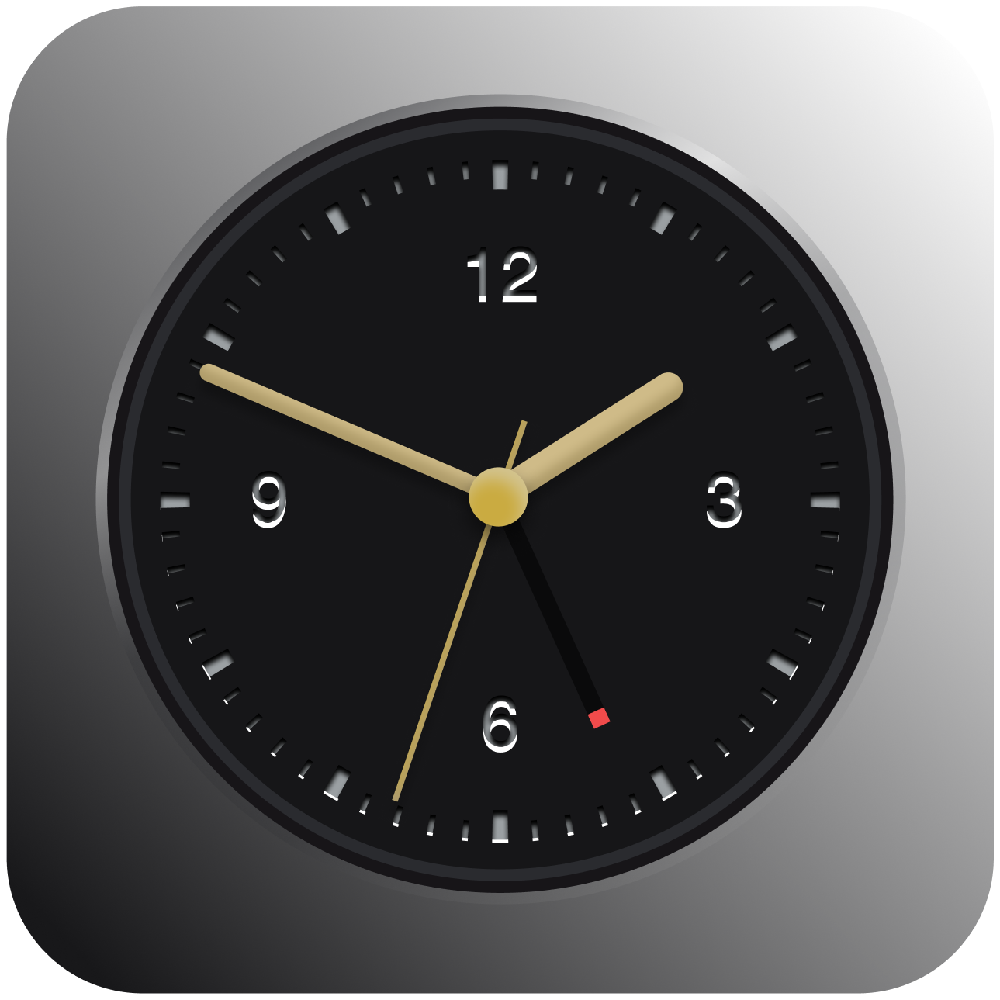
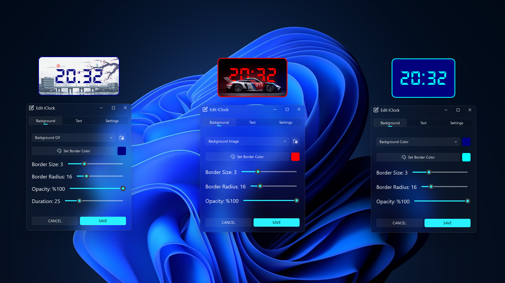

<p align="center">

</p>

<br>

<div align="center">

iClock
===========================
<h4> Fully Customizable Clock Widget </h4>

[](https://github.com/odest/iClock)
[](https://www.python.org/downloads/release/python-3120/)
[](https://pypi.org/project/PyQt5/5.15.10/)
[](https://github.com/odest/iClock)
[](https://github.com/odest/iClock)
[](https://github.com/odest/iClock?tab=GPL-3.0-1-ov-file#readme)
---

<br>

<div align="center">

**iClock** is an *open-source, cross-platform desktop clock widget* project. This project enables users to add an aesthetic and functional clock to their desktops. With the features offered by **iClock**, users can personalize their clocks and add a unique touch to their desktops.

</div></div>

<br>

<center>



</center>

<br>


## Table of Contents

  - [Table of Contents](#table-of-contents)
  - [Installation and Usage](#installation-and-usage)
  - [Customization Options](#customization-options)
  - [Features](#features)
  - [Platform Support Test](#platform-support-test)
  - [Sources](#sources)
  - [License](#license)

<br>


## Installation and Usage


*To install* **iClock**, *follow these steps:*

1. *Clone the repository:*

    ```bash
    git clone https://github.com/odest/iClock.git
    ```

2. *Navigate to the* **iClock** *directory:*

    ```bash
    cd iClock
    ```

3. *Install the required dependencies using* **pip:**

    ```bash
    pip install -r requirements.txt
    ```


4. *Run the* **main.py** *script using* **Python:**

    ```bash
    python main.py
    ```

<br>

  *By following these steps, you will have successfully installed* **iClock** *and its dependencies.*

<br>
<br>

> [!IMPORTANT]
> - If you encounter *ModuleNotFoundError: No module named 'PyQt5.QtSvg'* error in **Linux**, install the necessary modules as shown below:
> ```bash
> sudo apt-get install python3-pyqt5.qtsvg
> ```
> 
> - If you encounter *ModuleNotFoundError: No module named 'PyQt5.QtX11Extras'* error in **Linux**, install the necessary modules as shown below:
> ```bash
> sudo apt-get install python3-pyqt5.qtx11extras
> ```

<br>


## Customization Options
 
- **Background Customizations**
    - **Background Type**
      - **Gif**
      - **Image**
      - **Color**
    - **Background Opacity**
    - **Animation Duration**
    - **Border**
      - **Color**
      - **Size**
      - **Radius**
    
- **Text Customizations**
  - **Size**
  - **Coord**
  - **Opacity**
  - **Color**
  - **Font**

- **Settings**
  - **Show Tooltips**
  - **Show on Taskbar**
  - **Stays on Top**
  - **Blinking Colon**
  - **Advanced Options**
  - **Back to Default**


<br>


## Features

- **Fully Customizable:** *You can customize all components and details of the widget.*
- **Your preferences are remembered:** *Once customized and saved, you can use it in the same way every time.*
- **Ability to revert to default configurations:** *At any time, you can revert to the default configurations and start reconfiguring as needed.*

<br>

- **Flexibility:** *You can bring and utilize the widget in any size you desire.*
- **Mobility:** *You can move the widget anywhere you want and use it freely.*
- **Positioning:** *You can position and use the widget wherever you desire by fixing it to your preferred location.*

<br>

- **Tooltips:** *You can choose whether tooltips are displayed or not.*
- **Taskbar Visibility:** *You can choose whether the widget appears on the taskbar.*
- **Stays on Top:** *You can choose whether the widget appears above or below other applications.*

<br>

- **Background GIF:** *You can add any animated GIF you want to the background.*
- **Background Image:** *You can add any image you want to the background.*
- **Background Color:** *You can add any color you want to the background.*

<br>

## Platform Support Test

*A test result table regarding whether it works on which operating system:*

|Windows|Linux|MacOs|
|--|--|--|
|<table> <tr><th>Platform</th><th>Test Result</th></tr><tr><td>Windows 11</td><td>${\color{#00FF00}passed}$</td></tr> <tr><td>Windows 10</td><td>${\color{#00FF00}passed}$</td></tr><tr><td>Windows 8.1</td><td>${\color{#f28c07}not\space tested}$</td></tr> <tr><td>Windows 8</td><td>${\color{#f28c07}not\space tested}$</td></tr> <tr><td>Windows 7</td><td>${\color{#f28c07}not\space tested}$</td></tr>  </table>|<table><tr><th>Platform</th><th>Test Result</th></tr><tr><td>MX Linux (MX-23.2 / Fluxbox / x64)</td><td>${\color{#00FF00}passed}$</td></tr><tr></tr><tr><td>Debian (12-12.5 / Gnome / x64)</td><td>${\color{#00FF00}passed}$</td></tr></table>| <table> <tr><th>Platform</th><th>Test Result</th></tr><tr><td>macOS 14 (Sonoma)</td><td>${\color{#f28c07}not\space tested}$</td></tr><tr><td>macOS 13 (Ventura)</td><td>${\color{#f28c07}not\space tested}$</td></tr> <tr><td>macOS 12 (Monterey)</td><td>${\color{#f28c07}not\space tested}$</td></tr> <tr><td>macOS 11 (Big Sur)</td><td>${\color{#f28c07}not\space tested}$</td></tr> <tr><td>macOS 10.15 (Catalina)</td><td>${\color{#f28c07}not\space tested}$</td></tr></table>|

<br>

## Sources
- **DS-Digital Font** *from* **[DAFONT](https://www.dafont.com/ds-digital.font)**
- **Typefesse Font** *from* **[VELVETYNE](https://velvetyne.fr/fonts/typefesse/)**
- **Background Gif** *from* **[LENNSAN](https://lennsan.tumblr.com/image/157438772656)**
- **Background Image** *from* **[WSUPERCARS](https://www.wsupercars.com/car-wallpaper-download/?title=2023%20Porsche%20911%20GT3%20R%20Rennsport&res=2800%20x%202100&pic=https://www.wsupercars.com/wallpapers-regular/Porsche/2023-Porsche-911-GT3-R-Rennsport-004-2100.jpg)**
- **Svg Icons** *from* **[FEATHERICONS](https://feathericons.com/)**
- **Png Icons** *from* **[FLATICON](https://www.flaticon.com/)**

> [!NOTE]
> *You can take a look at the* **[assets.json](https://github.com/odest/iClock/blob/master/src/data/assets.json)** *file for more detailed information.*

<br>

## License  
- *This project is licensed under the* **GPL-3.0 License** - *see the* [LICENSE](https://github.com/odest/iClock?tab=GPL-3.0-1-ov-file) *file for details.*
